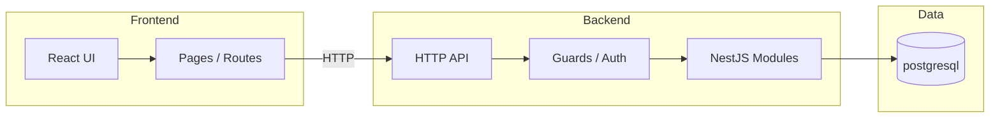

# Architecture — brownfield-repo

<!-- auto:summary -->
**Primary stack:** nestjs
**Entry points:** backend/src/main.js
<!-- /auto -->

## Layer diagram

<!-- auto:diagram -->

<!-- /auto -->

## Entry points (from source)

<!-- auto:entry-points -->
- `backend/src/main.js` (4 lines)
<!-- /auto -->

## Modules and boundaries

<!-- auto:modules -->
- **Home.test** (`frontend/src/pages/Home.test.tsx`) — page
- **Home** (`frontend/src/pages/Home.tsx`) — page
- **/** (`frontend/src/App.tsx`) — react-route
- **/users** (`frontend/src/App.tsx`) — react-route
- **UsersModule** (`backend/src/users/users.module.js`) — nestjs-module
<!-- /auto -->

## Auth patterns

<!-- auto:auth -->
- **Guard: JwtAuthGuard** — `backend/src/auth/jwt-auth.guard.js`
- **NestJS guards** — `backend/src/auth/jwt-auth.guard.js`
<!-- /auto -->

## Data flow

<!-- auto:dataflow -->
### `backend/src/main.js`
- External: `pg`

### Frontend routes
- `/` → `frontend/src/App.tsx`
- `/users` → `frontend/src/App.tsx`
- `/home` → `frontend/src/pages/Home.tsx`

### Data layer
- **postgresql** — pg driver
<!-- /auto -->

## Critical paths

<!-- AGENT:complete -->
_Optional: name 1–2 business-critical flows (e.g. login, checkout) if not obvious from routes alone._
<!-- /AGENT -->
